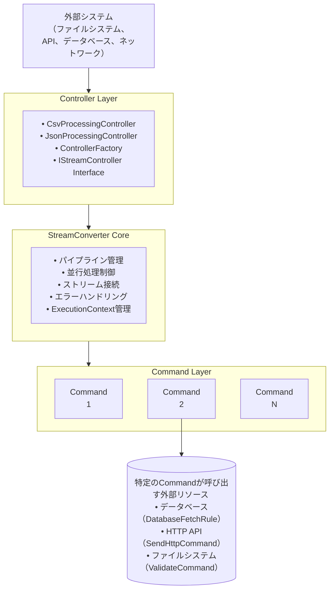

# StreamConverter アーキテクチャドキュメント

**Version**: 1.2.0  
**作成日**: 2025-08-13  
**更新日**: 2025-08-13

## 📋 目次

1. [理念とコンセプト](#理念とコンセプト)
2. [全体アーキテクチャ](#全体アーキテクチャ)
3. [階層構造](#階層構造)
4. [コンポーネント詳細](#コンポーネント詳細)
5. [データフロー](#データフロー)
6. [設計原則](#設計原則)
7. [拡張ガイドライン](#拡張ガイドライン)
8. [パフォーマンス考慮事項](#パフォーマンス考慮事項)

## 🎯 理念とコンセプト

### 基本理念

StreamConverterは**外側にバッファを持つ**条件において、**上から読み下す処理（Command）の集合**として定義可能な処理群を、**大きさに上限を持たないデータ**に対して適用させる仕組みを実装容易にするためのフレームワークです。

### 核となるコンセプト

- **ストリーミング処理**: メモリ使用量を一定に保ちながら大容量データを処理
- **コマンドパターン**: 処理単位を独立したコマンドとして分離
- **パイプライン型処理**: 複数の処理を連結して複雑な変換を実現
- **非同期並行処理**: 複数コマンドの同時実行によるスループット向上

## 🏗️ 全体アーキテクチャ



## 📐 階層構造

### 1. 外部システム層
- **責務**: データの提供とStreamConverterの呼び出し
- **例**: Webアプリケーション、バッチ処理、ファイル処理システム

### 2. Controller層
- **責務**: 
  - StreamConverterを構成するCommandの生成・設定
  - 外部システムとの入出力ストリーム管理
  - 複雑な設定ルールの隠蔽

### 3. StreamConverter層
- **責務**:
  - Commandの束ね方と実行順序の管理
  - 並行処理の制御
  - Command間のIOStream接続
  - エラーハンドリングとロギング
  - ExecutionContextの管理と伝播

### 4. Command層
- **責務**:
  - InputStreamからOutputStreamへの純粋な変換処理
  - 各Commandは独立して動作
  - 共通処理はAbstractStreamCommandで実装

## 🔧 コンポーネント詳細

### StreamConverter Core

```java
public class StreamConverter {
    private List<IStreamCommand> commands;
    private ExecutionContext defaultContext;
    
    // パイプライン実行の核となるメソッド
    public void run(InputStream inputStream, OutputStream outputStream) throws IOException
}
```

**主要機能**:
- **並行パイプライン実行**: `CompletableFuture`による非同期処理
- **ストリーム接続**: `PipedInputStream/PipedOutputStream`による中間接続
- **エラー伝播**: 例外の適切な処理と再スロー
- **コンテキスト管理**: MDCを通じたマルチスレッド環境での情報伝播

### Command Interface Hierarchy

```java
// 基本インターフェース
public interface IStreamCommand {
    void execute(InputStream inputStream, OutputStream outputStream) throws IOException;
    default void execute(InputStream inputStream, OutputStream outputStream, ExecutionContext context) throws IOException;
}

// 抽象基底クラス
public abstract class AbstractStreamCommand implements IStreamCommand {
    // 共通機能: ログ出力, パフォーマンス測定, エラーハンドリング
    public final void execute(InputStream inputStream, OutputStream outputStream) throws IOException;
    protected abstract void process(MeasuredInputStream input, MeasuredOutputStream output) throws IOException;
}
```

### 典型的なCommand実装

#### 1. Validator Commands
- **CsvValidateCommand**: CSVフォーマットと必須カラムの検証
- **JsonValidateCommand**: JSONスキーマ検証
- **xml.ValidateCommand**: XMLスキーマ検証

#### 2. Navigation Commands
- **CsvNavigateCommand**: CSV特定列の抽出・変換
- **JsonNavigateCommand**: JSONPath指定による値抽出
- **XmlNavigateCommand**: XPath指定による要素抽出

#### 3. Transformation Commands
- **CharacterConvertCommand**: 文字エンコーディング変換
- **xml.ConvertCommand**: XSLT変換
- **LineEndingNormalizeCommand**: 行末文字の正規化

#### 4. Communication Commands
- **SendHttpCommand**: HTTP API呼び出し

#### 5. Rule-based Commands
- **DatabaseFetchRule**: データベースからの値取得による置換

### Controller Layer

```java
// 統一インターフェース
public interface IStreamController {
    List<CommandResult> process(InputStream inputStream, OutputStream outputStream) throws IOException;
    boolean isConfigured();
    String getConfigurationDescription();
}

// 具体実装例
public class CsvProcessingController extends AbstractStreamController {
    public static CsvProcessingController forColumnExtraction(String columnName);
    public static CsvProcessingController forComplexProcessing(String column, String processor);
}
```

### Factory Pattern

```java
// Command生成の統一化
public class CommandFactory {
    public static IStreamCommand createCommand(CommandConfig config);
    public static IStreamCommand[] createPipeline(CommandConfig[] configs);
}

// Controller生成の統一化
public class ControllerFactory {
    public static IStreamController getController(String inputType, String outputType);
    public static CsvProcessingController getCsvController();
}
```

## 🌊 データフロー

### 基本的なデータフロー

```
[外部データ] 
    ↓ InputStream
[Controller] 
    ↓ コマンド設定
[StreamConverter] 
    ↓ パイプライン実行
[Command 1] → [PipedStream] → [Command 2] → [PipedStream] → [Command N]
    ↓ 並行処理
[出力データ] ← OutputStream
```

### 並行処理における内部フロー

```java
// StreamConverterの内部実装例
CompletableFuture<Void> command1Future = CompletableFuture.runAsync(() -> {
    commands.get(0).execute(inputStream, pipedOutput1, context);
});

CompletableFuture<Void> command2Future = CompletableFuture.runAsync(() -> {
    commands.get(1).execute(pipedInput1, pipedOutput2, context);
});

// 全コマンドの完了を待機
CompletableFuture.allOf(command1Future, command2Future, ...).get();
```

### ExecutionContext の伝播

```java
// コンテキスト情報の管理
ExecutionContext context = ExecutionContext.builder()
    .globalContext("requestId", "REQ-12345")
    .globalContext("userId", "user789")
    .build();

// MDCへの反映とスレッド間伝播
context.applyToMDC("PROCESSING");
```

## 📏 設計原則

### 1. 単一責任原則 (SRP)
- **Command**: 一つの変換処理のみを担当
- **Controller**: 設定とI/O管理のみを担当
- **StreamConverter**: パイプライン管理のみを担当

### 2. 開放/閉鎖原則 (OCP)
- 新しいCommandの追加は既存コードを変更せずに可能
- Controllerの拡張は既存インターフェースを保持

### 3. インターフェース分離原則 (ISP)
- `IStreamCommand`: 最小限のメソッドのみ定義
- `IStreamController`: 外部システムに必要な機能のみ提供

### 4. 依存性逆転原則 (DIP)
- 具象クラスではなくインターフェースに依存
- Factoryパターンによるオブジェクト生成の抽象化

### 5. ストリーミング原則
- **メモリ効率**: 大容量データでも一定のメモリ使用量
- **バッファ外部化**: 対向システムがバッファリングを担当
- **逐次処理**: データを上から下へ順次処理

## 🚀 拡張ガイドライン

### 新しいCommandの作成

```java
public class CustomProcessCommand extends AbstractStreamCommand {
    
    @Override
    protected void process(MeasuredInputStream input, MeasuredOutputStream output) throws IOException {
        // 1. InputStreamからデータを読み取り
        // 2. 必要な変換処理を実行
        // 3. OutputStreamに結果を書き込み
        // 注意: メモリ使用量を抑えた実装にする
    }
    
    @Override
    protected String getCommandDetails() {
        return "CustomProcessCommand: " + processingRule;
    }
}
```

### 新しいControllerの作成

```java
public class CustomController extends AbstractStreamController {
    
    @Override
    protected CommandConfig[] configureCommands() {
        return new CommandConfig[] {
            new CommandConfig(CustomProcessCommand.class, "説明", parameter1),
            new CommandConfig(ValidatorCommand.class, "検証", parameter2)
        };
    }
    
    @Override
    public String getInputDataType() { return "CUSTOM_FORMAT"; }
    
    @Override
    public String getOutputDataType() { return "PROCESSED_DATA"; }
}
```

### Rule実装の拡張

```java
public interface ITransformationRule {
    String apply(String input);
}

// DatabaseFetchRuleのような外部リソース連携Rule
public class ApiCallRule implements ITransformationRule {
    public String apply(String input) {
        // HTTP APIを呼び出して結果を取得
        return restClient.get("/api/transform?input=" + input);
    }
}
```

## ⚡ パフォーマンス考慮事項

### メモリ効率

- **ストリーミング処理**: 固定サイズバッファでの読み書き
- **PipedStream**: コマンド間の中間データバッファリング
- **ガベージコレクション**: 大量のオブジェクト生成を避ける設計

### 並行処理最適化

- **CompletableFuture**: 非同期実行による並列化
- **ExecutorService**: スレッドプール管理
- **背圧制御**: 高速Producer/低速Consumer問題への対処

### 測定とモニタリング

```java
// AbstractStreamCommandでの自動測定
private long measureExecutionTime() { /* 実行時間測定 */ }
private long measureMemoryUsage() { /* メモリ使用量測定 */ }
private long measureDataSize() { /* データサイズ測定 */ }
```

### 典型的なパフォーマンス指標

- **メモリ使用量**: 50MB以下（大容量データ処理時）
- **スループット**: 10MB/秒以上
- **レスポンス時間**: データサイズに比例（1MB/秒の処理速度）

## 🛡️ セキュリティ考慮事項

### 入力検証

- **XPath/JSONPath**: インジェクション攻撃防止
- **ファイルパス**: パストラバーサル攻撃防止
- **URL**: SSRF攻撃防止（プライベートIP制限）

### エラーハンドリング

- **例外の適切な伝播**: セキュアな情報露出防止
- **ログ出力**: 機密情報のログ出力防止
- **リソースリーク**: ストリームの確実なクローズ

## 📚 関連ドキュメント

- [Controller層アーキテクチャ](streamconverter-core/src/main/java/com/streamConverter/controller/CONTROLLER_ARCHITECTURE.md)
- [自動ログ機能](AUTO_LOGGING.md)
- [テスト戦略](TESTING.md)
- [セキュリティ分析](SECURITY_ANALYSIS.md)
- [ベンチマーク実装](BENCHMARK_IMPLEMENTATION.md)

---

このドキュメントは開発チームの認識統一を目的として作成されており、プロジェクトの進化に合わせて継続的に更新されます。
