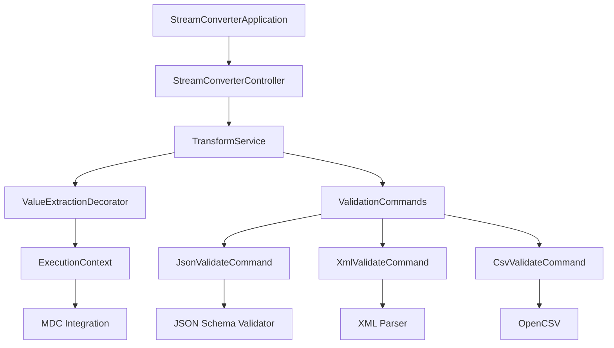
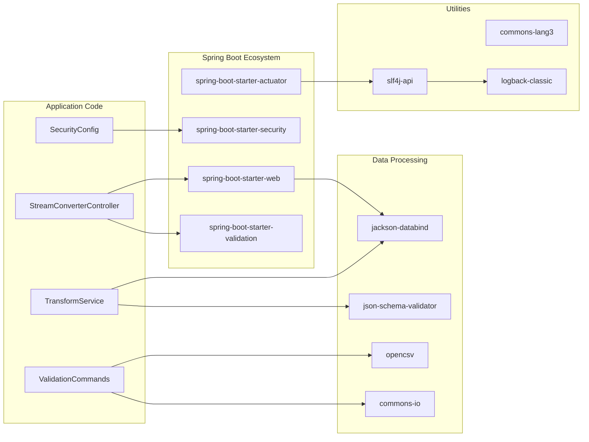
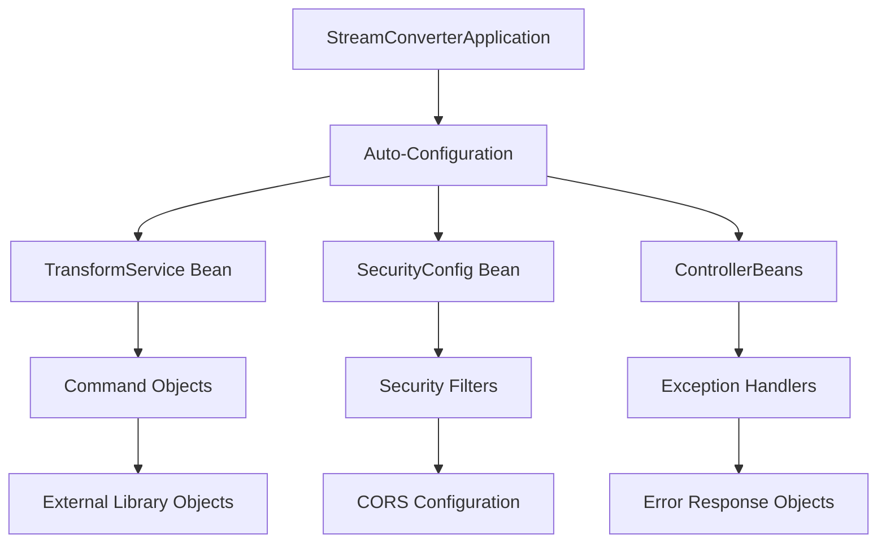

# StreamConverter アーキテクチャ依存関係

このドキュメントでは、StreamConverterの内部モジュール間の依存関係とアーキテクチャレイヤーを説明します。

## アーキテクチャ概要

```
┌─────────────────────────────────────────────────────────────┐
│                        WebAPI Layer                         │
├─────────────────────────────────────────────────────────────┤
│ Controller Layer    │ DTO Layer       │ Exception Handling  │
│ - StreamConverter   │ - TransformReq  │ - GlobalException   │
│   Controller        │ - TransformResp │   Handler           │
├─────────────────────────────────────────────────────────────┤
│                       Service Layer                         │
├─────────────────────────────────────────────────────────────┤
│ Business Logic      │ Pipeline Builder │ Value Extraction   │
│ - TransformService  │ - Command        │ - Decorator        │
│                     │   Factory        │   Pattern          │
├─────────────────────────────────────────────────────────────┤
│                      Command Layer                          │
├─────────────────────────────────────────────────────────────┤
│ Stream Commands     │ Validation      │ Context Management  │
│ - AbstractStream    │ - JSON/XML/CSV  │ - ExecutionContext  │
│   Command           │   Validators    │ - MDC Integration   │
├─────────────────────────────────────────────────────────────┤
│                   Infrastructure Layer                      │
├─────────────────────────────────────────────────────────────┤
│ Spring Boot        │ External Libs    │ Configuration       │
│ - Web/Security     │ - JSON Schema    │ - Application.yml   │
│ - Actuator         │ - OpenCSV        │ - Security Config   │
└─────────────────────────────────────────────────────────────┘
```

## 依存関係マップ

### 1. Core Dependencies (コア依存関係)



### 2. External Library Dependencies (外部ライブラリ依存関係)



## レイヤー別依存関係詳細

### WebAPI Layer

#### StreamConverterController
```java
// 直接依存関係
@RestController
public class StreamConverterController {
    // Service Layer
    private final TransformService transformService; // ← Service依存
    
    // Spring Framework
    @Autowired // ← Spring DI
    @Valid @RequestBody // ← Validation
    @Operation // ← OpenAPI/Swagger
}
```

#### DTO Classes
```java
// 外部ライブラリ依存関係
public class TransformRequest {
    @NotBlank          // ← jakarta.validation
    @Pattern           // ← jakarta.validation  
    @Schema            // ← swagger annotations
}
```

### Service Layer

#### TransformService
```java
// 依存関係注入パターン
@Service
public class TransformService {
    // Command Layer依存
    private IStreamCommand buildTransformPipeline(request) {
        return new ValueExtractionDecorator(    // ← Command Layer
            new SampleStreamCommand(),          // ← Command Layer
            request.getInputFormat(),
            request.getExtractionPath(),
            request.getMdcKey()
        );
    }
    
    // 外部ライブラリ使用
    private Map<String, String> getExtractedValues() {
        return MDC.getCopyOfContextMap();       // ← SLF4J MDC
    }
}
```

### Command Layer

#### ValueExtractionDecorator
```java
// 複数外部ライブラリ依存
public class ValueExtractionDecorator {
    private final ObjectMapper objectMapper;           // ← Jackson
    
    private String extractFromJson(String json) {
        JsonNode node = objectMapper.readTree(json);   // ← Jackson
    }
    
    private String extractFromXml(String xml) {
        DocumentBuilder builder = factory               // ← Java XML API
            .newDocumentBuilder();
    }
    
    private String extractFromCsv(String csv) {
        String[] lines = csvString.split("\n");        // ← Java Core
    }
}
```

#### Validation Commands
```java
// JSON Validation
public class JsonValidateCommand {
    private final JsonSchemaFactory schemaFactory;     // ← json-schema-validator
    private final ObjectMapper objectMapper;           // ← Jackson
}

// CSV Validation  
public class CsvValidateCommand {
    public void consume(InputStream input) {
        CSVReader reader = new CSVReader(               // ← OpenCSV
            new InputStreamReader(input)
        );
    }
}
```

## Configuration Dependencies (設定依存関係)

### Spring Boot Configuration
```yaml
# application.yml の依存関係影響
spring:
  security:          # ← spring-boot-starter-security
    user:
      name: admin
      password: ${ADMIN_PASSWORD:streamconverter123}
      
management:          # ← spring-boot-starter-actuator
  endpoints:
    web:
      exposure:
        include: health,info,metrics

springdoc:           # ← springdoc-openapi
  api-docs:
    path: /api-docs
  swagger-ui:
    path: /swagger-ui.html
```

### Security Configuration
```java
@Configuration
@EnableWebSecurity   // ← Spring Security
public class SecurityConfig {
    
    @Bean
    public SecurityFilterChain filterChain(HttpSecurity http) {
        return http
            .cors(cors -> cors.configurationSource(   // ← CORS設定
                corsConfigurationSource()
            ))
            .authorizeHttpRequests(authz -> authz     // ← 認証設定
                .requestMatchers("/api/v1/**").authenticated()
            )
            .build();
    }
}
```

## Runtime Dependencies (実行時依存関係)

### Spring Boot Auto-Configuration
実行時に自動設定される依存関係：

```
spring-boot-starter-web:
├── DispatcherServlet        (自動設定)
├── Jackson2ObjectMapper     (自動設定)  
├── Tomcat EmbeddedServer    (自動設定)
└── Spring MVC Config        (自動設定)

spring-boot-starter-security:
├── SecurityFilterChain      (自動設定)
├── AuthenticationManager    (自動設定)
└── PasswordEncoder          (自動設定)

spring-boot-starter-actuator:
├── HealthIndicators         (自動設定)
├── MetricsRegistry          (自動設定)
└── EndpointMappings        (自動設定)
```

### Bean Dependencies Graph


## Testing Dependencies (テスト依存関係)

### Test Layer Architecture
```java
// 統合テスト依存関係
@WebMvcTest(StreamConverterController.class)
class StreamConverterControllerTest {
    @Autowired MockMvc mockMvc;                    // ← Spring Test
    @MockBean TransformService transformService;   // ← Mockito
    @Autowired ObjectMapper objectMapper;          // ← Jackson
}

// Service Layer テスト
class TransformServiceTest {
    private TransformService transformService;     // ← Test Target
    
    @BeforeEach
    void setUp() {
        transformService = new TransformService();  // ← Direct Instantiation
        MDC.clear();                               // ← SLF4J MDC
    }
}
```

## Circular Dependencies Prevention (循環依存関係の防止)

### Layer Separation Rules
1. **上位レイヤーは下位レイヤーに依存可能**
2. **下位レイヤーは上位レイヤーに依存禁止**
3. **同一レイヤー内でのみ相互依存許可**

```
WebAPI Layer     (Controller, DTO, Exception)
    ↓ OK
Service Layer    (TransformService, Business Logic)
    ↓ OK  
Command Layer    (Commands, Decorators, Context)
    ↓ OK
Infrastructure   (Spring Boot, External Libraries)
```

### Dependency Injection Pattern
```java
// Good: Constructor Injection (推奨)
@Service
public class TransformService {
    private final ValidationService validationService;
    
    public TransformService(ValidationService validationService) {
        this.validationService = validationService;
    }
}

// Avoid: Field Injection (非推奨)
@Service
public class TransformService {
    @Autowired
    private ValidationService validationService;  // ← テストが困難
}
```

## Performance Impact (パフォーマンス影響)

### Library Loading Time
```
Spring Boot Startup:
├── Auto-configuration scan:    ~800ms
├── Bean instantiation:         ~400ms
├── Security setup:             ~200ms
├── Web server startup:         ~300ms
└── External lib loading:       ~200ms
Total:                          ~1.9s
```

### Memory Footprint
```
Runtime Memory Usage:
├── Spring Framework:           ~15MB
├── Jackson (JSON):            ~3MB
├── OpenCSV:                   ~1MB
├── JSON Schema Validator:      ~2MB
├── Application Code:           ~5MB
└── Tomcat Embedded:           ~8MB
Total:                         ~34MB
```

## Dependency Health Monitoring (依存関係健全性監視)

### Regular Health Checks
```bash
# 依存関係脆弱性チェック
./gradlew dependencyCheckAnalyze

# 依存関係更新確認
./gradlew dependencyUpdates

# ライセンス確認
./gradlew generateLicenseReport

# 使用されていない依存関係検出
./gradlew unusedDependencies
```

### Automated Monitoring
```yaml
# GitHub Actions での定期チェック
name: Dependency Check
on:
  schedule:
    - cron: '0 2 * * 1'  # 毎週月曜日2時
jobs:
  dependency-check:
    runs-on: ubuntu-latest
    steps:
      - uses: actions/checkout@v3
      - name: Run dependency check
        run: ./gradlew dependencyCheckAnalyze
```

---

**更新日**: 2025-07-29  
**次回更新予定**: 依存関係更新時、または新機能追加時