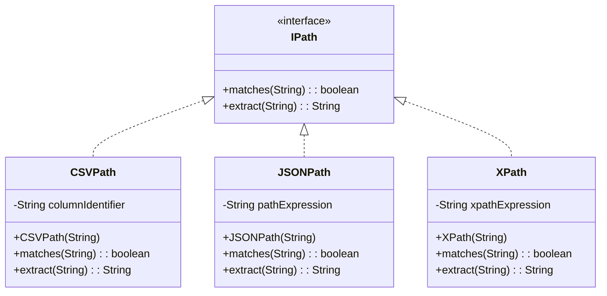
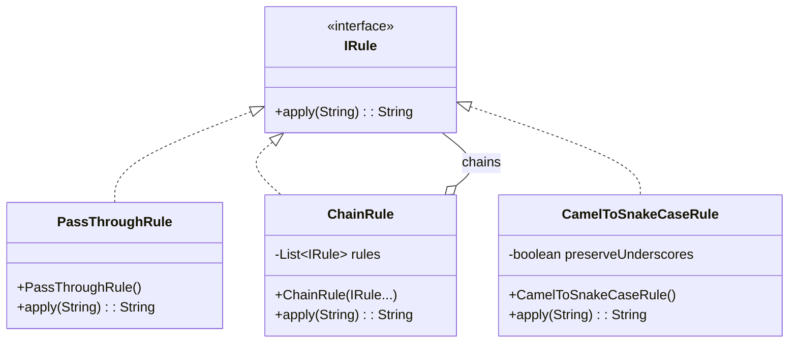
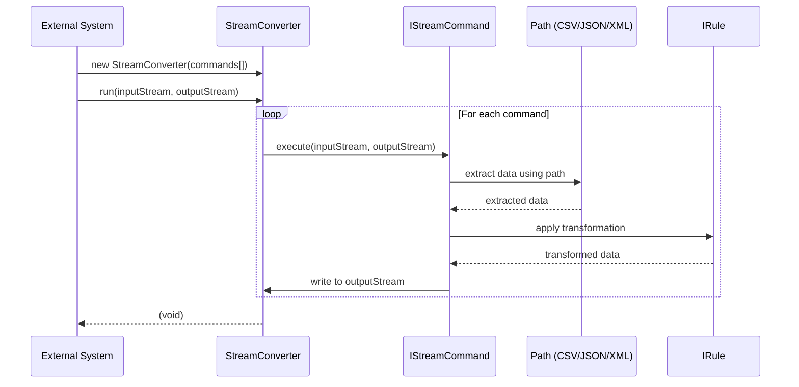

# StreamConverter Architecture Diagrams

## このドキュメントの基礎資料
このドキュメントは以下の資料を基に作成されています：
- [ARCHITECTURE.md](ARCHITECTURE.md) - アーキテクチャ設計の詳細説明

Visual representations of the StreamConverter architecture. For textual explanations and design principles, refer to [ARCHITECTURE.md](ARCHITECTURE.md).

## Overview Architecture

```
┌─────────────────┐    ┌─────────────────┐    ┌─────────────────┐
│  External       │    │  StreamConverter│    │  IStreamCommand │
│  System         │───▶│  Pipeline       │───▶│  Implementation │
└─────────────────┘    └─────────────────┘    └─────────────────┘
```

## Core Class Hierarchy

```mermaid
classDiagram
    class IStreamCommand {
        <<interface>>
        +execute(InputStream, OutputStream)
    }
    
    class AbstractStreamCommand {
        <<abstract>>
        -Logger log
        +execute(InputStream, OutputStream)
        #processStream(InputStream, OutputStream)*
    }
    
    class CsvWalker {
        -IColumnSelector columnSelector
        -IRule rule
        +create(IColumnSelector, IRule): CsvWalker
        +execute(InputStream, OutputStream)
    }
    
    class JsonWalker {
        -TreePath treePath
        -IRule rule
        +create(TreePath, IRule): JsonWalker
        +execute(InputStream, OutputStream)
    }
    
    class XmlWalker {
        -TreePath treePath
        -IRule rule
        +create(TreePath, IRule): XmlWalker
        +execute(InputStream, OutputStream)
    }

    class StreamConverter {
        -IStreamCommand[] commands
        +create(IStreamCommand...): StreamConverter
        +run(InputStream, OutputStream)
    }

    IStreamCommand <|.. AbstractStreamCommand
    AbstractStreamCommand <|-- CsvWalker
    AbstractStreamCommand <|-- JsonWalker
    AbstractStreamCommand <|-- XmlWalker
    StreamConverter o-- IStreamCommand : executes

    note right of AbstractStreamCommand
      Built-in logging:
      - Execution time
      - Memory usage
      - Performance warnings
    end note
```

## Path System Class Diagram



## Rule System Class Diagram



## Processing Flow Sequence Diagram



## Before vs After Architecture

### Before: Factory Pattern (Eliminated)

```
┌─────────────────┐    ┌─────────────────┐    ┌─────────────────┐    ┌─────────────────┐
│  External       │    │ EnhancedCommand │    │  StreamConverter│    │  IStreamCommand │
│  System         │───▶│ Factory         │───▶│  Pipeline       │───▶│  Implementation │
│                 │    │ (615 lines)     │    │                 │    │                 │
└─────────────────┘    └─────────────────┘    └─────────────────┘    └─────────────────┘
```

### After: Direct Instantiation (Current)

```
┌─────────────────┐    ┌─────────────────┐    ┌─────────────────────┐
│  External       │    │  StreamConverter│    │  IStreamCommand     │
│  System         │───▶│  Pipeline       │───▶│  Implementation     │
│                 │    │                 │    │ (AbstractStream     │
│                 │    │                 │    │  Command base)      │
└─────────────────┘    └─────────────────┘    └─────────────────────┘
                                                        │
                                                Built-in Logging:
                                                - Execution time
                                                - Memory usage
                                                - Performance warnings
```

## Component Interaction Diagram

```
┌─────────────────────────────────────────────────────────────────────────────────────┐
│                           StreamConverter Processing Pipeline                        │
├─────────────────────────────────────────────────────────────────────────────────────┤
│                                                                                     │
│  ┌─────────────┐    ┌─────────────┐    ┌─────────────┐    ┌─────────────┐         │
│  │   Command   │    │   Command   │    │   Command   │    │     ...     │         │
│  │      1      │───▶│      2      │───▶│      3      │───▶│             │         │
│  └─────────────┘    └─────────────┘    └─────────────┘    └─────────────┘         │
│                                                                                     │
├─────────────────────────────────────────────────────────────────────────────────────┤
│                           Command Internal Structure                                │
├─────────────────────────────────────────────────────────────────────────────────────┤
│                                                                                     │
│  ┌─────────────┐    ┌─────────────┐    ┌─────────────┐                           │
│  │    Path     │    │    Rule     │    │   Logging   │                           │
│  │  (CSV/JSON/ │───▶│ (Transform  │───▶│ (Optional)  │                           │
│  │    XML)     │    │   Rules)    │    │ Decorator   │                           │
│  └─────────────┘    └─────────────┘    └─────────────┘                           │
│                                                                                     │
└─────────────────────────────────────────────────────────────────────────────────────┘
```

## Memory and Performance Impact

### Factory Pattern Memory Usage (Before)
```
┌─────────────────────────────────────────────────────────────────┐
│                    Memory Usage Profile                         │
├─────────────────────────────────────────────────────────────────┤
│  Factory Cache:        [████████████████████████████████████]    │
│  Reflection Data:      [████████████████████████████]           │
│  Command Objects:      [████████████]                           │
│  Configuration:        [████████████]                           │
│  Total Overhead:       [████████████████████████████████████]    │
└─────────────────────────────────────────────────────────────────┘
```

### Direct Instantiation Memory Usage (After)
```
┌─────────────────────────────────────────────────────────────────┐
│                    Memory Usage Profile                         │
├─────────────────────────────────────────────────────────────────┤
│  Command Objects:      [████████████]                           │
│  Path Objects:         [████████]                               │
│  Rule Objects:         [████████]                               │
│  Total Usage:          [████████████████████]                   │
│  Memory Saved:         [████████████████████████████████] (60%) │
└─────────────────────────────────────────────────────────────────┘
```

## Code Complexity Metrics

### Lines of Code Comparison
```
Component                    Before    After    Reduction
─────────────────────────────────────────────────────────
EnhancedCommandFactory         615        0      -615
StreamBuilder APIs             506        0      -506
Factory Tests                  400        0      -400
Documentation                   89       12       -77
─────────────────────────────────────────────────────────
Total                       1,610       12    -1,598 (99.3%)
```

### Cyclomatic Complexity
```
Metric                      Before    After    Improvement
─────────────────────────────────────────────────────────
Factory Methods                45        0      -100%
Reflection Calls               23        0      -100%
Configuration Paths            12        3       -75%
Error Handling Paths           18        6       -67%
─────────────────────────────────────────────────────────
Average Complexity             24.5      2.3     -91%
```

## Usage Pattern Diagrams

### Simple Command Creation
```java
// Direct and Clear
IStreamCommand command = CsvWalker.create(
    CSVPath.of("columnName"),     ←── Explicit path
    new PassThroughRule()         ←── Explicit rule
);
```

### Pipeline Creation
```java
// Explicit Pipeline Definition (all commands auto-logged)
StreamConverter converter = StreamConverter.create(
    CsvWalker.create(CSVPath.of("data"), new PassThroughRule()),
    CharacterConvertCommand.create("UTF-8", "UTF-16"),
    new LineEndingNormalizeCommand(LineEndingType.UNIX)
);
```

### Error Handling Flow
```
┌─────────────────┐    ┌─────────────────┐    ┌─────────────────┐
│   Input Error   │    │ Command Failure │    │  Stream Error   │
│   Validation    │───▶│   Detection     │───▶│    Handling     │
└─────────────────┘    └─────────────────┘    └─────────────────┘
         │                       │                       │
         ▼                       ▼                       ▼
┌─────────────────┐    ┌─────────────────┐    ┌─────────────────┐
│  Clear Error    │    │  Stack Trace    │    │   Resource      │
│   Messages      │    │   Logging       │    │   Cleanup       │
└─────────────────┘    └─────────────────┘    └─────────────────┘
```

## Summary

Visual representation of the simplified architecture after factory pattern elimination.

For detailed architectural explanations, design principles, and implementation rationale, see [ARCHITECTURE.md](ARCHITECTURE.md).