# Class Relationship Diagram

This document provides a class diagram illustrating the relationships between the main components of the Controller and Command layers in the StreamConverter project.

## Mermaid Class Diagram

```mermaid
classDiagram
    direction LR

    class ControllerFactory {
        +getController(String, String): IStreamController
        +getController(String, OutputType): IStreamController
        +createWithCommandFactory(String, OutputType, boolean): IStreamController
        +getCsvController(): CsvControllerBuilder
        +getJsonController(): JsonControllerBuilder
        +registerController(String, String, IStreamController)
        +registerBuilder(String, ControllerBuilder)
        +getRegisteredTypes(): String[]
        +clearRegistry()
    }

    class IStreamController {
        <<interface>>
        +process(InputStream, OutputStream): List~CommandResult~
        +isConfigured(): boolean
        +getConfigurationDescription(): String
        +getInputDataType(): String
        +getOutputDataType(): String
    }

    class AbstractStreamController {
        <<abstract>>
        #configureCommands(): CommandConfig[]
        #streamConverter: StreamConverter
        +process(InputStream, OutputStream)
    }

    class CsvProcessingController {
        +forColumnExtraction(String): CsvProcessingController
        +forComplexProcessing(String, String): CsvProcessingController
    }

    class JsonProcessingController {
        +forPropertyExtraction(String, boolean): JsonProcessingController
        +forTransformation(String, String[]): JsonProcessingController
    }

    class StreamConverter {
        +run(InputStream, OutputStream): List~CommandResult~
        +create(List~IStreamCommand~): StreamConverter
    }

    class CommandFactory {
        +createWithLogging(Class, Object[]): IStreamCommand
        +createPipelineWithLogging(CommandConfig[]): IStreamCommand[]
    }

    class CommandConfig {
        -commandClass: Class
        -args: Object[]
    }

    class IStreamCommand {
        <<interface>>
        +execute(InputStream, OutputStream)
        +execute(InputStream, OutputStream, ExecutionContext)
    }

    class AbstractStreamCommand {
        <<abstract>>
        #_execute(InputStream, OutputStream)
        #getCommandDetails(): String
        -getUsedMemory(): long
    }

    class LoggingDecorator {
        -delegate: IStreamCommand
        +execute(InputStream, OutputStream)
    }

    class ContextPropagatingDecorator {
        -delegate: IStreamCommand
        +execute(InputStream, OutputStream, ExecutionContext)
    }

    class ConsumerCommand {
        <<abstract>>
        #_execute(InputStream, OutputStream)
    }

    class CsvNavigateCommand
    class JsonNavigateCommand
    class XmlNavigateCommand
    class SampleStreamCommand
    class SendHttpCommand
    class ConvertCommand

    class ExecutionContext {
        +getTraceId(): String
        +getStartTime(): long
        +getMetadata(): Map~String,Object~
    }

    class OutputType {
        <<enumeration>>
        CSV_COLUMN
        JSON_PROPERTY
        VALIDATED_JSON_PROPERTY
        JSON_FORMATTED
        PROCESSED_DATA
        TRANSFORMED_DATA
        CSV
    }

    ControllerFactory ..> IStreamController : creates
    ControllerFactory ..> CsvProcessingController : creates via builder
    ControllerFactory ..> JsonProcessingController : creates via builder

    IStreamController <|-- AbstractStreamController
    AbstractStreamController <|-- CsvProcessingController
    AbstractStreamController <|-- JsonProcessingController

    AbstractStreamController o-- StreamConverter : uses
    StreamConverter o-- "1..*" IStreamCommand : orchestrates

    AbstractStreamController ..> CommandFactory : uses to create pipeline
    CommandFactory ..> CommandConfig : uses
    CommandFactory ..> IStreamCommand : creates

    IStreamCommand <|-- AbstractStreamCommand
    IStreamCommand <|-- LoggingDecorator
    IStreamCommand <|-- ContextPropagatingDecorator
    LoggingDecorator o-- IStreamCommand : decorates
    ContextPropagatingDecorator o-- IStreamCommand : decorates

    AbstractStreamCommand <|-- ConsumerCommand
    AbstractStreamCommand <|-- CsvNavigateCommand
    AbstractStreamCommand <|-- JsonNavigateCommand
    AbstractStreamCommand <|-- XmlNavigateCommand
    AbstractStreamCommand <|-- SampleStreamCommand
    AbstractStreamCommand <|-- SendHttpCommand
    AbstractStreamCommand <|-- ConvertCommand

    %% ExecutionContext relationships
    IStreamCommand ..> ExecutionContext : uses
    ContextPropagatingDecorator *-- ExecutionContext : manages

    %% OutputType usage
    ControllerFactory ..> OutputType : uses

    %% IRule Interface and Implementations
    class IRule {
        <<interface>>
        +apply(String input) String
    }

    class PassThroughRule {
        +apply(String input) String
    }

    class DatabaseFetchRule {
        -String databaseUrl
        -String query
        -Pattern SQL_INJECTION_PATTERN
        +DatabaseFetchRule(String databaseUrl, String query)
        +apply(String input) String
        -validateDatabaseUrl(String url) String
        -validateQuery(String queryString) String
        -sanitizeInput(String input) String
    }

    class PooledDatabaseFetchRule {
        -DatabaseConnectionPool connectionPool
        -String query
        +PooledDatabaseFetchRule(DatabaseConnectionPool pool, String query)
        +apply(String input) String
        +getPoolStats() String
    }

    class DatabaseConnectionPool {
        -String databaseUrl
        -int maxPoolSize
        -BlockingQueue~Connection~ availableConnections
        +DatabaseConnectionPool(String databaseUrl, int maxPoolSize, long timeoutMs)
        +getConnection() Connection
        +returnConnection(Connection connection)
        +getPoolStats() String
        +shutdown()
    }

    %% IRule Implementation relationships
    IRule <|.. PassThroughRule
    IRule <|.. DatabaseFetchRule
    IRule <|.. PooledDatabaseFetchRule

    %% IRule usage in Commands
    CsvNavigateCommand o-- IRule : uses
    JsonNavigateCommand o-- IRule : uses
    XmlNavigateCommand o-- IRule : uses

    %% DatabaseConnectionPool relationships
    PooledDatabaseFetchRule *-- DatabaseConnectionPool : uses

```

## Diagram Description

This diagram shows the separation of concerns between the Controller, Core, and Command layers.

*   **Controller Layer (Left)**:
    *   `ControllerFactory` creates implementations of `IStreamController` with support for `OutputType` enum and CommandFactory integration.
    *   Provides type-safe controller creation and registry management for reuse.
    *   External systems interact with the `IStreamController` interface to `process` streams.
    *   `AbstractStreamController` uses `StreamConverter` to execute the processing and `CommandFactory` to build the command pipeline.
    *   Controllers implement `getConfigurationDescription()` for enhanced debugging and monitoring.

*   **Core Layer (Center)**:
    *   `StreamConverter` manages the execution flow of an `IStreamCommand` pipeline.

*   **Command Layer (Right)**:
    *   `CommandFactory` creates instances of `IStreamCommand` based on `CommandConfig`.
    *   `LoggingDecorator` wraps `IStreamCommand` to add logging functionality.
    *   `ContextPropagatingDecorator` wraps `IStreamCommand` to add execution context support.
    *   Concrete commands like `CsvNavigateCommand` inherit from `AbstractStreamCommand` to implement specific processing logic.
    *   `ConsumerCommand` provides an abstract base for consumer-type commands.
    *   `ExecutionContext` provides traceability and context propagation for multi-threaded execution.

*   **Rule Layer (Bottom)**:
    *   `IRule` interface defines the contract for data transformation rules.
    *   `PassThroughRule` provides a default no-op implementation.
    *   `DatabaseFetchRule` implements database data fetching with security features (SQL injection prevention, input sanitization).
    *   `PooledDatabaseFetchRule` provides high-performance database access using connection pooling.
    *   `DatabaseConnectionPool` manages database connections efficiently for reuse.
    *   Navigate commands (`CsvNavigateCommand`, `JsonNavigateCommand`, `XmlNavigateCommand`) use `IRule` implementations to transform data at specific locations within the stream.
