# Class Relationship Diagram

This document provides a class diagram illustrating the relationships between the main components of the Controller and Command layers in the StreamConverter project.

## Mermaid Class Diagram

```mermaid
classDiagram
    direction LR

    class ControllerFactory {
        +getController(String, String): IStreamController
        +getCsvController(): CsvControllerBuilder
        +getJsonController(): JsonControllerBuilder
        +registerController(String, String, IStreamController)
    }

    class IStreamController {
        <<interface>>
        +process(InputStream, OutputStream): List~CommandResult~
        +isConfigured(): boolean
        +getInputDataType(): String
        +getOutputDataType(): String
    }

    class AbstractStreamController {
        <<abstract>>
        #configureCommands(): CommandConfig[]
        #streamConverter: StreamConverter
        +process(InputStream, OutputStream)
    }

    class CsvProcessingController {
        +forColumnExtraction(String): CsvProcessingController
        +forComplexProcessing(String, String): CsvProcessingController
    }

    class JsonProcessingController {
        +forPropertyExtraction(String, boolean): JsonProcessingController
        +forTransformation(String, String[]): JsonProcessingController
    }

    class StreamConverter {
        +run(InputStream, OutputStream): List~CommandResult~
        +create(List~IStreamCommand~): StreamConverter
    }

    class CommandFactory {
        +createWithLogging(Class, Object[]): IStreamCommand
        +createPipelineWithLogging(CommandConfig[]): IStreamCommand[]
    }

    class CommandConfig {
        -commandClass: Class
        -args: Object[]
    }

    class IStreamCommand {
        <<interface>>
        +execute(InputStream, OutputStream)
    }

    class AbstractStreamCommand {
        <<abstract>>
        #_execute(InputStream, OutputStream)
    }

    class LoggingDecorator {
        -delegate: IStreamCommand
        +execute(InputStream, OutputStream)
    }

    class CsvNavigateCommand
    class JsonNavigateCommand
    class XmlNavigateCommand
    class SampleStreamCommand

    ControllerFactory ..> IStreamController : creates
    ControllerFactory ..> CsvProcessingController : creates via builder
    ControllerFactory ..> JsonProcessingController : creates via builder

    IStreamController <|-- AbstractStreamController
    AbstractStreamController <|-- CsvProcessingController
    AbstractStreamController <|-- JsonProcessingController

    AbstractStreamController o-- StreamConverter : uses
    StreamConverter o-- "1..*" IStreamCommand : orchestrates

    AbstractStreamController ..> CommandFactory : uses to create pipeline
    CommandFactory ..> CommandConfig : uses
    CommandFactory ..> IStreamCommand : creates

    IStreamCommand <|-- AbstractStreamCommand
    IStreamCommand <|-- LoggingDecorator
    LoggingDecorator o-- IStreamCommand : decorates

    AbstractStreamCommand <|-- CsvNavigateCommand
    AbstractStreamCommand <|-- JsonNavigateCommand
    AbstractStreamCommand <|-- XmlNavigateCommand
    AbstractStreamCommand <|-- SampleStreamCommand

```

## Diagram Description

This diagram shows the separation of concerns between the Controller, Core, and Command layers.

*   **Controller Layer (Left)**:
    *   `ControllerFactory` creates implementations of `IStreamController` (e.g., `CsvProcessingController`, `JsonProcessingController`).
    *   External systems interact with the `IStreamController` interface to `process` streams.
    *   `AbstractStreamController` uses `StreamConverter` to execute the processing and `CommandFactory` to build the command pipeline.

*   **Core Layer (Center)**:
    *   `StreamConverter` manages the execution flow of an `IStreamCommand` pipeline.

*   **Command Layer (Right)**:
    *   `CommandFactory` creates instances of `IStreamCommand` based on `CommandConfig`.
    *   `LoggingDecorator` wraps `IStreamCommand` to add logging functionality.
    *   Concrete commands like `CsvNavigateCommand` inherit from `AbstractStreamCommand` to implement specific processing logic.
